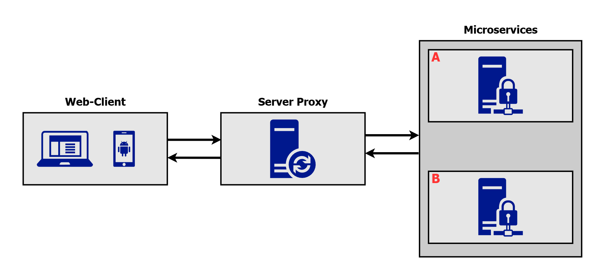

# Web-Client Angular Node Java
This project was developed using Angular, NodeJS and Java. It's a minimal full-stack application, where All components work together to provide JWT-based authentication, session revocation, and a protected static resource endpoint. The BFF route requests dynamically between Backend A and Backend B based on configuration.

### Overview




### Requirements
- Java (v17 recommended)
- MAVEN
- Node.js (v22+ recommended)
- NPM

Clone the Repository
```bash
  git clone https://github.com/danielmontes9/web-client-angular-node-java.git
```

## Java Microservices

### How to Run This Spring Boot Project

1. Navigate into
```bash
  cd backend-java
```

2. Install Dependencies in every Backend (A and B)
```bash
  mvn clean install
```

3. Run every Backend (A and B)
```bash
  cd backend-java-a
  ./mvnw spring-boot:run
```
The app will run at: http://localhost:8081

```bash
  cd backend-java-b
  ./mvnw spring-boot:run
```
The app will run at: http://localhost:8082

Note: Each microservice is a separate Spring Boot app. Make sure you configure the application.yml file with a different port.


## Node Server Proxy

### How to Run This Express Project
1. Navigate into
```bash
  cd bff-nodejs
```

2. Install Dependencies
```bash
  npm install
```

3. Create .env file
```bash
  TARGET_BACKEND_A=http://localhost:8081
  TARGET_BACKEND_B=http://localhost:8082
  PORT=3000
```
Place the .env file in the root of the project

4. Run the Express App
```bash
  npm start
```
The app will run at: http://localhost:3000

## Angular Web Client

### How to Run This Angular Project
1. Navigate into
```bash
  cd frontend-angular
```

2. Install Dependencies
```bash
  npm install
```

3. Run the Angular App
```bash
  npx ng serve
```
The app will run at: http://localhost:4200
